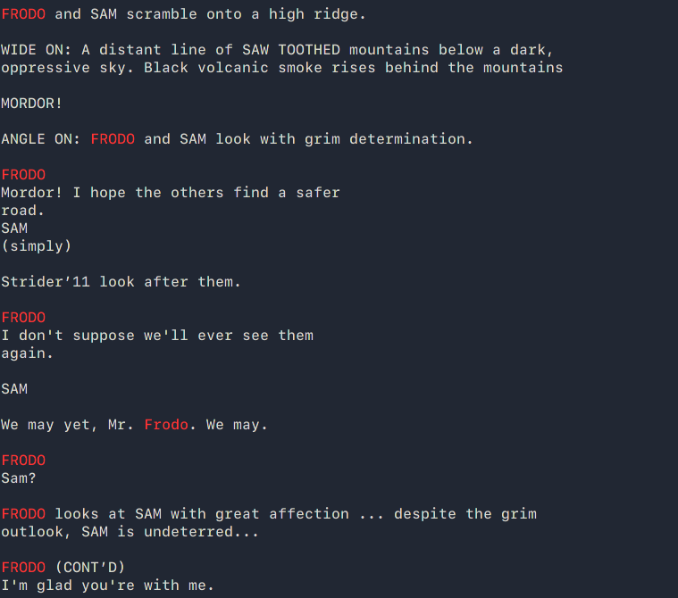
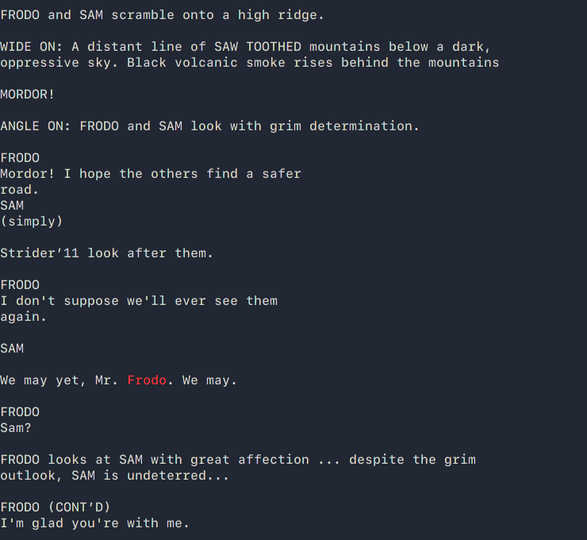

# HPrint

## A small Tool designed to highlight strings inside of a text file based on the given input

### Install:
```
make

sudo make install
```

### Run:
```
hprint -p [STRING] FILE

Optional Switches:
     -m     Match Case
```


Example:

##### No Case Matching:
```hprint -p "Frodo" lotr.txt```




##### Case Matching:
```hprint -mp "Frodo" lotr.txt```




### Contributing:
Pull Requests are Welcomed
